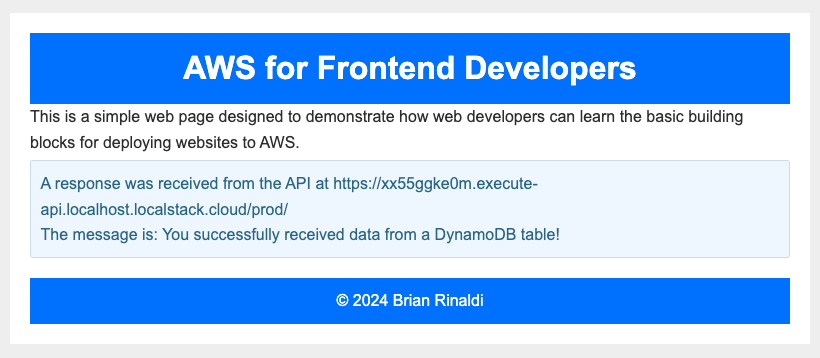

# Getting Started with AWS for Front-end Developers

The first time I tried to start working with AWS, I felt a bit overwhelmed. It felt like there were thousands of services and even just navigating between them, nevermind learning how to use them, seemed like a daunting task. I admit that I stepped away and it took me a few years to truly come back.

The interesting this is that, during those years, I used AWS services, just not directly. There's a whole cottage industry, especially in full stack web development, of tools and services that manage deploying cloud services for you. These are usually built on AWS but the actual services and deployment is abstracted away from you – just add a function in this folder and _poof_ an AWS Lambda is magically deployed for you.

Whether you choose to continue using these tools (don't get me wrong, I'm a big fan), it's worth understanding all the AWS primitives that tend to be used in developing a web application. In many cases, building on the primitives rather than the abstractions can improve your application performance and save you money, but, regardless, knowledge about what the AWS primitives are and how they work will help your understanding of how modern web applications function.

### The Example Application

Before we get started, let's talk about the examples in this tutorial. The full example reponsitory can be found [on GitHub](https://github.com/remotesynth/aws-for-frontend-devs).

Each step in this tutorial series builds upon the previous. While the application we will deploy is intentionally simple, ultimately we start from a simple static site and end up with a page that calls a backend API that returns data from a data store.

While I definitely won't win any design awards, here's what the final result will look like. The result in the info box on the bottom of the page displays the result of the API call we'll make in the latter portions of this tutorial.



### Costs

All of the services we'll use have a free usage tier on AWS. In some cases, this is a permanent free tier depending on your usage and, in others, it's a temporary free tier. Each section includes pricing details for the service we will be using. Just note that if you deploy any of the demo steps that use services on a temporary free tier, you'll eventually want to remove it to prevent ongoing charges, even if they are minimal.

### Deploying the Examples

There are multiple options for creating services in AWS:

* You can use the AWS console and step through the configuration. This is often a good way to get comfortable with a service and it's options.
* You can use [CloudFormation](https://aws.amazon.com/cloudformation/), which is a YAML-based infrastructure-as-code tool for provisioning AWS resources. I find that it can be quite tricky to get right (and I've struggled with it myself in the past), but AI tools like Amazon Q or GitHub Copilot actually do a pretty great job of generating this for you nowadays.
* The [AWS CDK (Cloud Development Kit) let's you build out your infrastructure programmatically in code using languages like TypeScript, JavaScript, Python, Java, C# and Go. It has a bit of a learning curve, but can really feel the most comfortable of the three options in my view, since you are using a language you are already comfortable with.

All of the deployments in this tutorial are built using the CDK. It's worth understanding that, ultimately, the CDK generates a CloudFormation template for you. This means that the deployment details in your AWS dashboard will still be located under CloudFormation.

#### Deploying Locally

All of the provided examples can be run locally using a tool called [LocalStack](https://localstack.cloud). LocalStack provides a free and open source AWS emulator that you can run locally within a Docker container. You can find the open source project on [GitHub](https://github.com/localstack/localstack).

Running your AWS projects locally during development can make for much faster iteration as the deployment will take far less time and can reduce development costs by eliminating the need for testing environments running on AWS.

If you'd like to run these demos locally on LocalStack, first run through the [installation steps](https://docs.localstack.cloud/getting-started/installation/). My instructions rely on the LocalStack CLI to deploy and install as well as the [AWS CDK CLI for LocalStack](https://docs.localstack.cloud/user-guide/integrations/aws-cdk/#aws-cdk-cli-for-localstack), which  will perform the CDK deployments to the locally deployed LocalStack instance.

_Note: The deployments automatically push the web site and Lambda function assets for you, but this relies on functionality that requires a LocalStack Pro account. A free trial is available that should enable you to complete the tutorial._

#### Deploying to AWS

To deploy to AWS you will need the following:

* An [AWS account](https://portal.aws.amazon.com/gp/aws/developer/registration/index.html)
* The [AWS CLI](https://aws.amazon.com/cli/)
* The [AWS CDK CLI](https://docs.aws.amazon.com/cdk/v2/guide/getting_started.html#getting_started_install)

You will need to configure the AWS CLI for your account. I'll be transparent, if you are new to AWS, this isn't as simple as you might expect, but you can go through the [instructions here](https://docs.aws.amazon.com/cli/latest/userguide/cli-configure-sso.html#cli-configure-sso-configure).

## Section 1: AWS Fundamentals

I know. I know. It's always more fun to just start building. But before we can really dig into the various services that make up a typical web application deployed to AWS, we have to cover some fundamentals. 

### Understanding AWS Infrastructure

If you're like me, as a frontend developer, infrastructure is not your jam. I prefer to know as little as I possibly can. That being said, it's worth understanding some broad concepts when it comes to AWS because it can impact your decisions on how to deploy your services.

AWS [global infrastructure](https://aws.amazon.com/about-aws/global-infrastructure/) is made up of _regions_ (there are currently 33 of these as shown in the image below). These are essentially geographic areas that contain data centers where your services run. When you deploy a service, you'll choose to push it to one or more regions. For example, I often deploy services to `us-east-1` which is in Northern Virginia. In most cases, a single region will suffice (if you need multi-region, you probably aren't reading this article as you have a team that manages your AWS cloud infrastructure).


Each of these regions have 3 or more _availability zones_ (AZ). These are separate data centers within the region that make the zones resiliant. If, for example, one AZ goes down, another can take over and since, in most cases,  your services are replicated across the AZs. This means that your services will continue to function even in the case of a significant incident that impacts a single data center. That doesn't mean that AWS doesn't have outages, but they are very rare.

You will choose a region whenever you are deploying services. In most cases, you'll want to deploy all the various AWS services that make up your web application to the same region. You do not need to choose availability zones, though a few services may allow you to choose a cheaper option that isn't replicated acess AZs for data that isn't critical. In all the cases within this guide, we'll be using the standard version of each service.

### AWS Security Basics

Ok. Let's talk about security in AWS and AWS Identity and Access Management (aka IAM). I'm going to be straightforward. For me, as a web developer, working with IAM is like untangling a string of Christmas lights only to find that, once untangled, the lights aren't working because one single light, which you can't reliably locate, is not working. It's that fun.

Joking aside, you don't need to be an IAM expert to build web applications on AWS, but you do need to understand the basics of security in AWS, as it is common when building applications that utilize multiple services in AWS that you will encounter an issue specifically around access rights.

IAM is made up of four key components:

1. [Users](https://docs.aws.amazon.com/IAM/latest/UserGuide/id_users.html) are anything such as a person or application that needs to interact with services running within AWS.
2. [User groups](https://docs.aws.amazon.com/IAM/latest/UserGuide/id_groups.html) provide a means to assign permissions to multiple users. For example, all the developers on your team may have similar access rights and be in a developers group.
3. [Roles](https://docs.aws.amazon.com/IAM/latest/UserGuide/id_roles.html) are a bit more complex to explain, but play a large part in enabling access between services. A role, like a user, has specific permissions to access AWS services, but it is more like a temporary grant of rights to that access and does not have a password or access key like a user would. Any user, whether assigned to a person, application or service, can assume a role and thus be temporarily granted the access rights assigned to that role. Roles are typically how a service, like Lambda, for example, might be granted rights to read, write or delete from another service, like DynamoDB.

You manage access through [policies](https://docs.aws.amazon.com/IAM/latest/UserGuide/access_policies.html). Policies are typically written in JSON (though they can be created visually within the AWS console) define the specific granular access to every action that can be performed by or on a service. For example, there are about [70 actions defined for just Lambda](https://docs.aws.amazon.com/service-authorization/latest/reference/list_awslambda.html).

Clearly there's a lot more than I can cover in one tutorial about IAM, but, as you'll see, each service we create will typically need to be granted access to another service. We'll be defining this within our CDK code. For instance, when we create a CloudFront distribution in front of our S3 bucket, it won't work properly until it has been granted read rights to that S3 bucket.

For further reading, [this guide](https://dev.to/aws-builders/a-beginners-guide-to-aws-identity-and-access-management-iam-4j5c) by Sedat Salman is a really good, and easy to understand, overview that goes into a little bit more detail.

## Section 2: Web Site Building Blocks

One of the great things about the web is that not much is needed to get started creating web sites. You can use a simple text editor hand write static HTML, if that's how you roll. But you still need somewhere to put those files and, since the whole world can access your web page, you may want to put some caching in front of that. In this section, let's explore the AWS primitives that will enable that.

## Amazon S3

At its core, a web site or even web application is essentially nothing more than a collection of files: HTML, CSS, JavaScript, images, etc. This means that the very least you'll need is a place to store and serve these files, and this is where S3 fits in.

S3 is short for Simple Storage Service. S3 can store any kind of file-based asset, not just web site assets. Assets stored in S3 are called _objects_ and include both the file and any metadata about that file. Every object is given a _key_, which is its unique identifier. Finally, objects are placed in _buckets_, which are akin to folders in a file-system.

Objects within S3 can be versioned as well, meaning that S3 will keep multiple versions of the same object with the same key, but with different version numbers. This can be useful, but, for most web assets, isn't necessary and will increase the costs of using S3.

#### Key Benefits for Front-end Devs

As I mentioned, every web site is a collection of file-based assets, so what you need is an easy way to store them and make them easily and quickly accessible via the web, and S3 offers that. On top of that, it is protected against failure since S3 objects are replicated across at least three availability zones within the deployed region.

Keep in mind that S3 isn't just for web assets and, thus, offers various types of storage depending on the size, frequency of retrieval and replication that you need. For the purposes of web hosting, you'll likely want to use S3 Standard storage type which is for fast retrieval of frequently accessed objects.

#### Pricing

While there is no permanent free plan for S3, a free 12 month trial is available. Once the trial ends, the costs will depend on the size and type of storage you choose. You can see [full pricing details here](https://aws.amazon.com/s3/pricing/?did=ap_card).

#### Creating an S3 Bucket for a Web Site

There are multiple ways to handle pushing web assets to an S3 bucket. You can simply create an empty bucket and then upload objects individually or in bulk to it either via the web console, CLI, CDK or SDKs. Alternatively, you can create the bucket and upload the assets in the same operation as we'll do here (yes, you can update them afterwards if you want).

The example below creates an S3 bucket (`myWebAppBucket`) set up to serve a static web site. There are a number of parameters assigned to it that make this possible, including enabling public read access, setting the default index and error files and, for best practices, enforcing SSL.

We are also setting a CORS policy on the files in the bucket. This isn't technically necessary to view the site in this step, but, in future steps, we will be loading a JSON file from within the bucket using `fetch`, in which case this is needed.

Once the bucket is created, the CDK is uploading a group assets from a local folder named `site_assets` into the bucket. This folder contains the HTML, CSS and JavaScript files that run our demo site.

_Note: For this example, I am showing the necessary imports and other code required to create a full CDK script. However, as our examples get significantly longer, in future examples we will only explore the relevant parts of the CDK script to the service being discussed._

```javascript
import * as cdk from 'aws-cdk-lib';
import { Construct } from 'constructs';
import * as s3 from 'aws-cdk-lib/aws-s3';
import * as S3Deployment from "aws-cdk-lib/aws-s3-deployment";
import * as path from 'path';

export class S3Stack extends cdk.Stack {
  constructor(scope: Construct, id: string, props?: cdk.StackProps) {
    super(scope, id, props);

    // Create an S3 bucket configured for website hosting
    const bucket = new s3.Bucket(this, 'MyWebAppBucket', {
      enforceSSL: true,
      websiteIndexDocument: 'index.html',
      websiteErrorDocument: 'error.html',
      publicReadAccess: true,
      blockPublicAccess: {
        blockPublicPolicy: false,
        blockPublicAcls: false,
        ignorePublicAcls: false,
        restrictPublicBuckets: false,
      },
      cors: [
        {
          allowedMethods: [s3.HttpMethods.GET],
          allowedOrigins: ['*'],
          allowedHeaders: ['*'],
        },
      ],
    });

    new S3Deployment.BucketDeployment(this, "Deployment", {
      sources: [S3Deployment.Source.asset(path.join(__dirname, '../../site_assets'))],
      destinationBucket: bucket,
    });

    // Output the bucket website URL
    new cdk.CfnOutput(this, 'BucketWebsiteURL', {
      value: bucket.bucketWebsiteUrl,
    });
  }
}
```

#### Run the Example

The S3 example is in the `s3` folder of the [example project](https://github.com/remotesynth/aws-for-frontend-devs/tree/master/s3). To run this locally on LocalStack or remotely on AWS you'll first need to change into the proper directory and install the dependencies.

```bash
cd s3
npm install
```

**Running Locally on LocalStack**

Ensure that you have LocalStack started and running in another terminal window. The next step in the deployment is to bootstrap it, a process where the deployment is prepared.

```bash
cdklocal boostrap
```

Once this is complete, you can deploy it to your LocalStack instance running on Docker. You will be asked to confirm that you want to deploy the changes by entering "y".

```bash
cdklocal deploy
```

When the deployment is complete, you will see the outputs from the deployment that are defined in the CDK script above. In this case, it is just the `BucketWebsiteURL`. The outputs should look similar to what's below:

```bash
Outputs:
S3Stack.BucketWebsiteURL = http://s3stack-mywebappbucketb9f20f45-ef73011c.s3-website.localhost.localstack.cloud:4566
Stack ARN:
arn:aws:cloudformation:us-east-1:000000000000:stack/S3Stack/39770214
```

Copy the URL and navigate to it on your browser and the sample web site should appear.

**Running Remotely on AWS**

The process for deploying this remotely to AWS is almost identical, though it can take more time to run. Just use the `cdk` command instead of `cdklocal`.

```bash
cdk boostrap
cdk deploy
```

You should receive a similar output result containing the URL to view the static web page running remotely on S3.

#### Finishing Up

If all you need is a simple static web page running, congrats, you're done. Of course, you probably want to connect your domain name as well. There are a number of solutions to connect a domain to your statically hosted site on S3. If you want to stick entirely within the AWS ecosystem, you should check out [this guide](https://docs.aws.amazon.com/AmazonS3/latest/userguide/website-hosting-custom-domain-walkthrough.html) that uses Amazon's DNS service [Route 53](https://aws.amazon.com/route53/) and [Lambda@Edge](https://aws.amazon.com/lambda/edge/) for adding security headers at the edge. Both of these services are outside the full scope of this tutorial however.

### CloudFront

At this point, we've deployed some static web site assets to S3. However, they are deployed to a single specific region. This means that if I, for example, deployed my assets to `us-east-1`, every user globally trying to access those assets will need to connect to my resources in Northern Virginia. As you might imagine, this can cause painful latency in the responsiveness of my application.

This is why almost every modern deployment platform (ex. Netlify, Vercel, etc.) includes edge caching of static web assets. That's where CloudFront fits in. It is the CDN that provides the edge caching of your site's assets across over 600 nodes globally to ensure that every user is access data that is closest to their geographic location.

#### Key Benefits for Front-end Devs

This is all about improving the performance of your web application. A CloudFront distribution isn't technically necessary to run a web site, but since your site has a global audience and you want to ensure that they get the best experience, you will likely want to set one up.

#### Pricing

There is a permanent free level for CloudFront that is largely based upon the number of requests and amount of data transfer you need. For free you get 1 TB of data transfer out to the internet per month and 10,000,000 HTTP or HTTPS Requests per month. Plus it includes free SSL certificates. You can see [full pricing details here](https://aws.amazon.com/cloudfront/pricing/?nc=sn&loc=3).

#### Creating an CloudFront Distribution for Our Web Site

Let's update the prior example to add a CloudFront distribution in front of our static web site on S3. The CDK code below shows the sections that have changed from the prior script. We have modified the S3bucket to set the  access to private rather than public, since the traffic will be routed via CloudFront. We no longer need the bucket to be public, just CloudFront to have access to it. You'll see we are creating the appropriate permissions in the `oai` variable and then passing those in to CloudFront under `originAccessIdentity` for the S3 Bucket.


```javascript
// Create an S3 bucket configured for website hosting
const bucket = new s3.Bucket(this, 'MyWebAppBucket', {
  enforceSSL: true,
  websiteIndexDocument: 'index.html',
  websiteErrorDocument: 'error.html',
  blockPublicAccess: s3.BlockPublicAccess.BLOCK_ALL,
  accessControl: s3.BucketAccessControl.PRIVATE,
  cors: [
    {
      allowedMethods: [s3.HttpMethods.GET],
      allowedOrigins: ['*'],
      allowedHeaders: ['*'],
    },
  ],
});

// Create a CloudFront Distribution for our S3 hosted web site
const oai = new cloudfront.OriginAccessIdentity(this, 'OAI');
bucket.grantRead(oai);

const distribution = new cloudfront.CloudFrontWebDistribution(this, 'BackendCF', {
  originConfigs: [
    {
      s3OriginSource: {
        s3BucketSource: bucket,
        originAccessIdentity: oai,
      },
      behaviors: [{isDefaultBehavior: true}, { pathPattern: '/*', allowedMethods: cloudfront.CloudFrontAllowedMethods.GET_HEAD }]
    },
  ],
});

// Output the CloudFront distribution URL
new cdk.CfnOutput(this, 'CloudFrontDistributionURL', {
  value: distribution.distributionDomainName,
});
```

#### Run the Example

The CloudFormation example is in the `cf-s3` folder of the [example project](https://github.com/remotesynth/aws-for-frontend-devs/tree/master/cf-s3). To run this locally on LocalStack or remotely on AWS you'll first need to change into the proper directory and install the dependencies.

```bash
cd cf-s3
npm install
```

**Running Locally on LocalStack**

Ensure that you have LocalStack started and running in another terminal window. The next step in the deployment is to bootstrap it and then, once this is complete, we can deploy it to your LocalStack instance running on Docker.

```bash
cdklocal boostrap
cdklocal deploy
```

When the deployment is complete, you will see the outputs from the deployment that are defined in the CDK script above. In this case, it is just the `CloudFrontDistributionURL`. The outputs should look similar to what's below:

```bash
Outputs:
CFS3Stack.CloudFrontDistributionURL = 318df680.cloudfront.localhost.localstack.cloud
Stack ARN:
arn:aws:cloudformation:us-east-1:000000000000:stack/CFS3Stack/12f6c202
```

Copy the URL and navigate to it on your browser and the sample web site should appear.

**Running Remotely on AWS**

The process for deploying this remotely to AWS is almost identical. Just use the `cdk` command instead of `cdklocal`.

```bash
cdk boostrap
cdk deploy
```

You should receive a similar output result containing the URL to access the static web page running remotely on S3 via the cached CloudFront distribution.

#### Finishing Up

Congrats, you now have a globally cached static web site runing on a combination of S3 and CloudFront. However, before we move on, we have to discuss cache invalidation.

> There are 2 hard problems in computer science: cache invalidation, naming things, and off-by-1 errors.
> - Leon Bambrick

Our CloudFront distribution uses the default caching policy, which is 24 hours. So, if you were to upload a different version of `main.js`, for example, into the S3 bucket, you would not see this change on your web site...well, not until tomorrow.

One, very simple way around this is to add version numbers that change for certain files. Another would be to add some kind of timestamp or version when I load `main.js` since the cache is based upon the whole path, including the query string.

You could also manually invalidate a file or groups of files. For example, I could run this command to invalidate the `main.js` file cache for my distribution (note that you'll need to change the distribution ID to the ID of your deployed CloudFront distribution):

```bash
aws cloudfront create-invalidation --distribution-id E8VJ4TXBBR2YX --paths '/main.js'
```

You could invalidate everything by changing `/main.js` to `/*`.

The best solutions would be to:
* Change the Minimum TTL, Maximum TTL, and Default TTL in the CloudFront settings.
* Add a Cache-Control header with the max-age or s-maxage directive, or an Expires header to the file returned by S3 (this would probably require using something like [Lambda@Edge](https://aws.amazon.com/lambda/edge/) to add response headers at the edge).
* Add a [cache policy](https://docs.aws.amazon.com/AmazonCloudFront/latest/DeveloperGuide/controlling-the-cache-key.html) to your distribution that controls how CloudFront determines cache hits and the duration of the cache.

Yes, things start to get a little bit complicated when you start dealing with caches. For starters, you might work locally and then only push to the cloud when everything is ready, this way you can manually invalidate the cache only when changes have been deployed.

## Part 3: Web Application Building Blocks

Up to now, we've only deployed a static site, but, chances are, your application needs a backend. In this final section, we're going to dive into the pieces you'll need to add a backend to your web application running on AWS.

### Lambda

AWS Lambda is synonymous with serverless computing as it was the first serverless computing platform launched all the way back in 2014. You can use Lambdas to perform any type of compute you need to run, whether that's scheduled tasks, handling data processing, backend processes for a web application or even relatively long running tasks (their execution time limit can be set as high as 15 minutes). You can also use a range of languages to build Lambdas: Java, Go, PowerShell, Node. js, C#, Python, and Ruby.

The broad benefit of Lambdas is twofold: you only pay for what you use; and Lambdas can scale up or down depending on that usage (meaning your server won't go down because of too many requests). But this means that you need to be aware that [Lambdas have a lifecycle](https://docs.aws.amazon.com/lambda/latest/operatorguide/execution-environments.html) as they spin up and spin down. When a Lambda is initially invoked, it has a cold start that can cause some latency in the initial response. After a period of inactivity, the Lambda will terminate, meaning that anything stored in memory is lost and the next call will incur the cold start penalty.

#### Key Benefits for Front-end Devs

Lambas are the basis for the backend of many modern web applications. Rather than run on a monolithic web application server (ex. PHP, Ruby), many web applications use a microservices architecture that rely on a number of Lambdas to perform the backend processing necessary for the web site to function.

In fact, many full-stack frameworks like Next.js, for example, rely on serverless functions (in many cases AWS Lambda) to perform everything from backend processing to server-side rendering. Even if you ultimately end up relying on a full-stack framework to deploy all your backend to Lambdas for you, it's good to understand how they function.

### Pricing

Lambda pricing can be a little complicated since it relies on a combination of the number of requests, the amount of memory you consume and the amount of time it takes to process these request. However, Lambda does have an always free tier that allows 1 million free requests per month or up to 400,000 GB-seconds (i.e. memory usage) or 3.2 million seconds of compute time per month. You can find [full pricing details here](https://aws.amazon.com/lambda/pricing/).

### Adding a Lambda Function to Our Deployment

Let's imagine we wanted to make a simple Lambda function that we can call from your web application to perform some kind of backend processing. For example, maybe it's just a simple email signup for for your newsletter.

First, we need the function itself. Lambda functions invoke a handler when called. Here is a very generic handler that just returns a response body.

```javascript
export const handler = async (event) => {
  // perform the operation
  // return a response once it is completed
  const response = {
    statusCode: 200,
    body: {
      message: 'You successfully called the Lambda from a function URL!',
    },
  };
  return response;
};
```
However, our web application can't simply call a Lambda as it doesn't have a way of accessing it over HTTP. Thankfully, Lambdas allow for what's called a "function URL" that lets us to invoke the function handler over HTTP. The below CDK script snippet shows the changes to the prior script to add a Lambda function and function URL.

We create a function using the contents of the `lambda` directory, which currently just has an `index.mjs` file with the Lambda shown above. We'll choose a runtime (Node.js) and give the lambda a handler path. The `index.handler` path indicates that when the function is called it will invoke the `handler` function within `index.mjs`.

Once the Lambda function is created, we add a function URL. In this case, we've chose to allow GET and POST requests from any origin and without any authorization (so, keep in mind that this is as public as a URL endpoint can get).

We also want to provide a means of letting our static web site know the endpoint URL. In this case, we are outputting JSON data as part of the S3 bucket deployment into a `config.json` file. This file is included in addition to the assets from the `site_assets` folder.

```javascript
// Create a Lambda function using the assets in the Lambda directory
const lambdaFunction = new lambda.Function(this, 'HelloWorldFunction', {
  runtime: lambda.Runtime.NODEJS_LATEST,
  code: lambda.Code.fromAsset('lambda'),
  handler: 'index.handler',
  
});
// Add a public function URL to the Lambda function
const functionURL = lambdaFunction.addFunctionUrl({
  authType: lambda.FunctionUrlAuthType.NONE,
  cors:
    {
      allowedMethods: [HttpMethod.GET, HttpMethod.POST],
      allowedOrigins: ['*'],
    },
});

new S3Deployment.BucketDeployment(this, "Deployment", {
  sources: [S3Deployment.Source.asset(path.join(__dirname, '../../site_assets')),
  S3Deployment.Source.jsonData("config.json", { function_url: functionURL.url}),],
  destinationBucket: bucket,
});

// Output the Lambda function URL
new cdk.CfnOutput(this, 'LambdaFunctionURL', {
  value: functionURL.url,
});
```

#### Run the Example

The CloudFormation example is in the `lambda` folder of the [example project](https://github.com/remotesynth/aws-for-frontend-devs/tree/master/lambda). To run this locally on LocalStack or remotely on AWS you'll first need to change into the proper directory and install the dependencies.

```bash
cd lambda
npm install
```

**Running Locally on LocalStack**

Ensure that you have LocalStack started and running in another terminal window. The next step in the deployment is to bootstrap it and then, once this is complete, we can deploy it to your LocalStack instance running on Docker.

```bash
cdklocal boostrap
cdklocal deploy
```

When the deployment is complete, you will see the outputs from the deployment that are defined in the CDK script above. In this case, it is we'll get both the `CloudFrontDistributionURL` and the `LambdaFunctionURL`. The outputs should look similar to what's below:

```bash
Outputs:
LambdaStack.CloudFrontDistributionURL = 1228f746.cloudfront.localhost.localstack.cloud
LambdaStack.LambdaFunctionURL = http://ogz576cdhwbk362rxpnr8ztzchw58ac1.lambda-url.us-east-1.localhost.localstack.cloud:4566/
Stack ARN:
arn:aws:cloudformation:us-east-1:000000000000:stack/LambdaStack/75c9a0a1
```

If you copy the Lambda function URL and paste it into the browser, you should be able to view the JSON response from the function with the message.

```json
{"message": "You successfully called the Lambda from a function URL!"}
```

If you copy the CloudFront distribution URL and navigate to it on your browser, the sample web site should appear but this time it should be able to load the config and use the function URL to return a response in the info box on the page that reads something like:

> A response was received from the API at https://ogz576cdhwbk362rxpnr8ztzchw58ac1.lambda-url.us-east-1.localhost.localstack.cloud:4566/
>
> The message is: You successfully called the Lambda from a function URL!

**Running Remotely on AWS**

The process for deploying this remotely to AWS is almost identical. Just use the `cdk` command instead of `cdklocal`.

```bash
cdk boostrap
cdk deploy
```

You should receive a similar output result containing the URL to access the Lambda function and static web page running remotely on S3 via the cached CloudFront distribution that calls the Lambda function to get a response.

#### Finishing Up

Function URLs can be a useful tool if you have very limited backend requirements for your web app. They are extremely easy to configure and use. In many cases though, your application will require a more complete API. Let's explore how we'd do that.

## API Gateway

For one or two simple functions, adding a function URL to your Lambda is probably a workable solution, but if you are creating a complete backend (private or public) API, then you'll want the ability to maintain a full API using a custom domain and with clearly named endpoints.

API Gateway is a service purpose-built for managing, monitoring and securing either RESTful APIs, HTTP APIs or even WebSockets APIs, for real-time, two-way communication. It's important to note that the endpoints of the API do not have to be just Lambdas. You can also manage access through API keys or [Amazon Cognito](https://aws.amazon.com/cognito/).

#### Key Benefits for Front-end Devs

What API Gateway does may not sound sexy but it is absolutely necessary when building a full web application. API Gateway let's you organize your application's backend in a way that makes sense, with descriptive endpoint names under your own domain. It can also be used to ensure that you have the proper security on your API endpoints, whether they are private or public (and to what degree).

#### Pricing

API Gateway does not have a permanent free tier but does offer a free 12 month free tier for new AWS customers that includes 1 million API calls received for REST APIs and HTTP APIs, and 1 million messages and 750,000 connection minutes for WebSocket APIs. If you aren't elegible for the free tier pricing, the costs for HTTP APIs, REST APIs and WebSockets APIs are charged by per million requests and the cost per million decrease as usage increases. 

While we'll be building a REST API here, you can build a full backend using the HTTP API option, even connecting to Lambdas, but there are certain limitations. [This guide](https://www.netlify.com/blog/why-netlify-selected-astro-for-its-developer-hub-and-marketing-site/) is useful for determing which type of API you might need. Caching can also incur additional costs.

Full pricing details can be [found here](https://aws.amazon.com/api-gateway/pricing/).

#### Creating an API for Our Web Application

Before adding an API Gateway in front of our Lambda, we'll start by removing the Lambda function URL as it is no longer necessary. Instead we're going to access that function via the endpoint we define within API Gateway.

We'll start by defining the API Gateway itself targeting the Lambda function we defined earlier. Since we are just using a single Lambda function, we could have used the `LambdaRestApi()` method to create a proxy integration connecting the API Gateway instance with the single Lambda. Instead we are using the standard `RestApi()` method and adding the integration directly via the `LambdaIntegration()` method below. We chose this because it would allow us to run different API Gateway endpoints through other, separate Lambda functions rather than route them all through a single function.

We have also explicitly listed the CORS options, though these are also the defaults. Finally, we add the endpoint (we're using `/hello` since this is a "hello world" function) and allow the GET method, connecting it to the specific Lambda integration we created. I know, it all sounds way more complicated than it really is.

One last bit of complication though... I will admit that I am not a CORS expert, but, even though we have set up the CORS settings on the API Gateway itself, we need to pass the CORS headers back from the Lambda response as API Gateway expects a proxy response in a specific format.

```javascript
export const handler = async (event) => {
  let body = {
    message: 'You successfully called the Lambda from API Gateway!',
  };
  // perform the operation
  // return a response once it is completed
  const response = {
    statusCode: 200,
    headers: {
      'Access-Control-Allow-Headers':
        'Content-Type,X-Amz-Date,Authorization,X-Api-Key,X-Amz-Security-Token',
      'Access-Control-Allow-Methods': '*',
      'Access-Control-Allow-Origin': '*',
    },
    body: JSON.stringify(body),
  };
  return response;
};
```

Below you can see the changes we made to the prior CDK script:

```javascript
// Define the API Gateway resource
const api = new apigateway.RestApi(this, 'HelloWorldApi', {
  restApiName: 'RestAPI',
  defaultCorsPreflightOptions: {
    allowOrigins: apigateway.Cors.ALL_ORIGINS,
    allowMethods: apigateway.Cors.ALL_METHODS
  }
});
// Define the '/hello' resource with a GET method
const helloResource = api.root.addResource('hello');
const helloIntegration = new apigateway.LambdaIntegration(lambdaFunction);
helloResource.addMethod('GET', helloIntegration);

// Output the API Gateway URL
new cdk.CfnOutput(this, 'APIGatewayURL', {
  value: api.url,
});
```

While we could have connected our API Gateway to our CloudFront distribution to cache responses on our CDN, we have chosen not to set that up at this time. Also, while it isn't shown above, we have modified the JSON data we are writing to `config.json` in our S3 bucket to pass the API URL instead of the function URL.

#### Run the Example

The CloudFormation example is in the `api-gateway` folder of the [example project](https://github.com/remotesynth/aws-for-frontend-devs/tree/master/api-gateway). To run this locally on LocalStack or remotely on AWS you'll first need to change into the proper directory and install the dependencies.

```bash
cd api-gateway
npm install
```

**Running Locally on LocalStack**

Ensure that you have LocalStack started and running in another terminal window. The next step in the deployment is to bootstrap it and then, once this is complete, we can deploy it to your LocalStack instance running on Docker.

```bash
cdklocal boostrap
cdklocal deploy
```

When the deployment is complete, you will see the outputs from the deployment that are defined in the CDK script above. In this case, the output will contain the `APIGatewayURL` and `CloudFrontDistributionURL` as shown below.

```bash
Outputs:
APIGatewayStack.APIGatewayURL = https://44yuaqlf0c.execute-api.localhost.localstack.cloud:4566/prod/
APIGatewayStack.CloudFrontDistributionURL = 1d08f96d.cloudfront.localhost.localstack.cloud
APIGatewayStack.HelloWorldApiEndpointAD496187 = https://44yuaqlf0c.execute-api.localhost.localstack.cloud:4566/prod/
Stack ARN:
arn:aws:cloudformation:us-east-1:000000000000:stack/APIGatewayStack/dea4eb9f
```

If you copy the API Gateway URL, append the `hello` endpoint and paste it into the browser, you should be able to view the JSON response from the function with the message.

```json
{"message":"You successfully called the Lambda from API Gateway!"}
```

If you copy the CloudFront distribution URL and navigate to it on your browser, the sample web site should appear but this time it should be able to load the config and use the function URL to return a response in the info box on the page that reads something like:

> A response was received from the API at https://44yuaqlf0c.execute-api.localhost.localstack.cloud/prod/
>
> The message is: You successfully called the Lambda from API Gateway!

**Running Remotely on AWS**

The process for deploying this remotely to AWS is almost identical. Just use the `cdk` command instead of `cdklocal`.

```bash
cdk boostrap
cdk deploy
```

You should receive a similar output result containing the URL to access the Lambda function and static web page running remotely on S3 via the cached CloudFront distribution that calls the Lambda function via API Gateway to get a response.

#### Finishing Up

We've now got all the building blocks we need for building a full backend API for a full web application, assuming our backend is getting data from third-party APIs. But most applications need some sort of data, so, for our final piece, let's explore how to add that.

### DynamoDB

Every web application needs data. While some applications need the relational consistency that comes with a relational database, in many cases a NoSQL data store that provides fast performance can handle many, if not all, of a web applications data storage requirements.

DynamoDB is a fully-managed serverless, NoSQL data store. It stores everything in key-value pairs, but the value is a blob, meaning it can be a full document of data (for example, a JSON data structure). The [document model](https://aws.amazon.com/nosql/document/) treats the value as a document whereby you can query and update individual values. It provides both read consistency (supporting both eventually consistent and strongly consistent options) and ACID transactions.

#### Key Benefits for Front-end Devs

NoSQL databases provide a fast and easy way to build the data backend of your site. DynamoDB offers many of the features of other key-value and document stores that make it easy to use for backend web application data and it obviously integrates nicely within the AWS ecosystem. It's worth pointing out that other solutions like MongoDB have support for additional data types and querying capabilities out-of-the-box, but DynamoDB is known for its performance and also comes with replication across availability zones within a region by default.

#### Pricing

As with pretty much everything we've explored so far, DynamoDB pricing depends on a number of factors. First of all, you can choose to pay on-demand, which will adjust pricing based upon the number of reads and writes, the amount of data you store, the kind of backup you set up and the amount of data transfer out you use (among [other criteria](https://aws.amazon.com/dynamodb/pricing/on-demand/)..phew!).

You can alternatively choose to provision specific capacity, which can help with more predictability if you know how much usage your application will require.

The free tier includes:

* 25 GB of Storage
* 25 provisioned Write Capacity Units (WCU)
* 25 provisioned Read Capacity Units (RCU)

...which AWS says can handle up to 200M requests per month. I'll take their word for it.

#### Adding Data to Our Web Application

We're going to add a DyanmoDB table and populate it with some data (just a single row for the purposes of example). Then we are going to use Lambda to retrieve the data and return it back to our web application, via API Gateway, of course. We could have [integrated DyanmoDB directly with API Gateway](https://aws.amazon.com/blogs/compute/using-amazon-api-gateway-as-a-proxy-for-dynamodb/), but I assumed a more common usage would be to do something with the data in our backend before returning the result.

First, we need to update our Lambda to get data from DynamoDB. We are using the [AWS SDK for JavaScript](https://aws.amazon.com/sdk-for-javascript/) to connect with DynamoDB. The nice thing is that the latest release of this SDK is always pre-loaded in Lambda, so you do not need to install it (it's also pre-loaded into LocalStack too!).

In our Lambda, we are just doing a read from our table to get the data with the key of `message1`. We'll be inserting that data via our SDK script in a moment. Then we just return the value of the message in the JSON response back to our application.

```javascript
import { DynamoDBClient } from '@aws-sdk/client-dynamodb';
import { DynamoDBDocumentClient, GetCommand } from '@aws-sdk/lib-dynamodb';

const client = new DynamoDBClient({});
const docClient = DynamoDBDocumentClient.from(client);

export const handler = async (event) => {
  let body = {
    message: '',
  };
  // perform the operation
  const command = new GetCommand({
    TableName: process.env.DYNAMO_TABLE_NAME,
    Key: {
      id: 'message1',
    },
  });
  const data = await docClient.send(command);
  body.message = data.Item.message;
  // return a response once it is completed
  const response = {
    statusCode: 200,
    headers: {
      'Access-Control-Allow-Headers':
        'Content-Type,X-Amz-Date,Authorization,X-Api-Key,X-Amz-Security-Token',
      'Access-Control-Allow-Methods': '*',
      'Access-Control-Allow-Origin': '*',
    },
    body: JSON.stringify(body),
  };
  return response;
};
```

Next, lets look at what changed in the CDK script. First, we create a DynamoDB table with a partition key named `id`. Every table needs a partition key, as it is the equivalent of a primary key in a traditional RDMS. We did not define a sort key, which, as the name implies, would define how the data in the table is sorted. The topic of choosing the right partition key and sort key is outside the scope of this tutorial, but I recommend [this article](https://aws.amazon.com/blogs/database/choosing-the-right-dynamodb-partition-key/), which covers the topic in detail.

The next section is a script that inserts table records into DynamoDB once created. We're just inserting a single record.

We've also updated the Lambda function definition to set an environment variable with the DynamoDB table name (`DYNAMO_TABLE_NAME`) so that we know where to read the data from. You may have noticed that referenced in the Lambda code above.

Finally, we are granting the Lambda function permissions to read data in the DynamoDB table we created. Without this, we would get errors attempting to access data in the table.

```javascript
 // Create the DynamoDB table
const table = new dynamodb.Table(this, 'MyTable', {
  partitionKey: { name: 'id', type: dynamodb.AttributeType.STRING },
  removalPolicy: cdk.RemovalPolicy.DESTROY,
});

// initialize the data in the dynamo table
new customResource.AwsCustomResource(this, 'initTable', {
  onCreate: {
    service: 'DynamoDB',
    action: 'putItem',
    parameters: {
        TableName: table.tableName,
        Item: { id: { S: "message1" }, message: { S: "You successfully received data from a DynamoDB table!" } }
    },
    physicalResourceId: customResource.PhysicalResourceId.of(table.tableName + '_initialization')
  },
  policy: customResource.AwsCustomResourcePolicy.fromSdkCalls({ resources: customResource.AwsCustomResourcePolicy.ANY_RESOURCE }),
});

// Create a Lambda function using the assets in the Lambda directory
const lambdaFunction = new lambda.Function(this, 'HelloWorldFunction', {
  runtime: lambda.Runtime.NODEJS_LATEST,
  code: lambda.Code.fromAsset('lambda'),
  handler: 'index.handler',
  environment: {
    DYNAMO_TABLE_NAME: table.tableName,
  }
});

// give the function access to read data from the dynamo table
table.grantReadData(lambdaFunction);
```

#### Run the Example

The CloudFormation example is in the `dynamodb` folder of the [example project](https://github.com/remotesynth/aws-for-frontend-devs/tree/master/dynamodb). To run this locally on LocalStack or remotely on AWS you'll first need to change into the proper directory and install the dependencies.

```bash
cd dynamodb
npm install
```

**Running Locally on LocalStack**

Ensure that you have LocalStack started and running in another terminal window. The next step in the deployment is to bootstrap it and then, once this is complete, we can deploy it to your LocalStack instance running on Docker.

```bash
cdklocal boostrap
cdklocal deploy
```

When the deployment is complete, you will see the outputs from the deployment that are defined in the CDK script above. In this case, the output will contain the `APIGatewayURL` and `CloudFrontDistributionURL` as shown below.

```bash
Outputs:
DynamoDBStack.APIGatewayURL = https://4uaaw3as6h.execute-api.localhost.localstack.cloud:4566/prod/
DynamoDBStack.CloudFrontDistributionURL = e01548fd.cloudfront.localhost.localstack.cloud
DynamoDBStack.HelloWorldApiEndpointAD496187 = https://4uaaw3as6h.execute-api.localhost.localstack.cloud:4566/prod/
Stack ARN:
arn:aws:cloudformation:us-east-1:000000000000:stack/DynamoDBStack/db911fa6
```

If you copy the API Gateway URL, append the `hello` endpoint and paste it into the browser, you should be able to view the JSON response from the function pulling the data record we inserted into DynamoDB that contains the message displayed.

```json
{"message":"You successfully received data from a DynamoDB table!"}
```

If you copy the CloudFront distribution URL and navigate to it on your browser, the sample web site should appear but this time it should be able to load the config and use the function URL to return a response in the info box on the page that reads something like:

> A response was received from the API at https://4uaaw3as6h.execute-api.localhost.localstack.cloud/prod/
>
> The message is: You successfully received data from a DynamoDB table!

**Running Remotely on AWS**

The process for deploying this remotely to AWS is almost identical. Just use the `cdk` command instead of `cdklocal`.

```bash
cdk boostrap
cdk deploy
```

You should receive a similar output result containing the URL to access the Lambda function and static web page running remotely on S3 via the cached CloudFront distribution that calls API Gateway to access the Lambda function reading from a DynamoDB table to get a response.

#### Finishing Up

We've only really touched the surface of DynamoDB here as we are only reading a single row of simple data. A more real-world usage might include POST, PUT and DELETE methods in our API to handle creating, updating and deleting records in DynamoDB. We could also do more advanced querying on this data using attribute values.

### Closing Thoughts

Like the Hobbits at the end of the Fellowship of the Ring  after 500+ pages or 3 hours of runtime, we've managed to cover a ton of ground and yet still have so much more to cover. AWS is massive, covering over 200 different services, and we only managed to skim the surface of 5 of them.

While we can appreciate how much ground there is left to cover, let's acknowledge what we've learned:

* S3 can be used for hosting the static assets that make up a web application and can even serve as simple web server for a static web site.
* CloudFront is a CDN that can cache our assets at the edge around the globe to ensure our site has the fastest possible response time.
* Lambda functions can serve as the backend computing for your web application and, depending on your needs, you can even quickly add a function URL to a Lambda to call it directly from your application.
* API Gateway enables you to set up the full API backend for your web application with logical routes and manage access to the API by allowing both public and private methods.
* DynamoDB is a ultra-fast NoSQL data store that can be quickly set up as the data backend to your application to store any type of data you need.

I'd be remiss if I didn't mention that AWS offers a framework that pulls together the services discussed here and others to build full stack web applications called [AWS Amplify](https://aws.amazon.com/amplify/) that supports a wide range of frameworks.

That being said, you may still choose to use your framework or platform of choice, but understanding some of the pieces involved only makes you a stronger and more flexible developer.

But it also offers you the opportunity to potentially explore dropping the frameworks and abstractions when it makes sense, which can potentially result in better performance, lower cost and less of a black box when it comes to architecture.