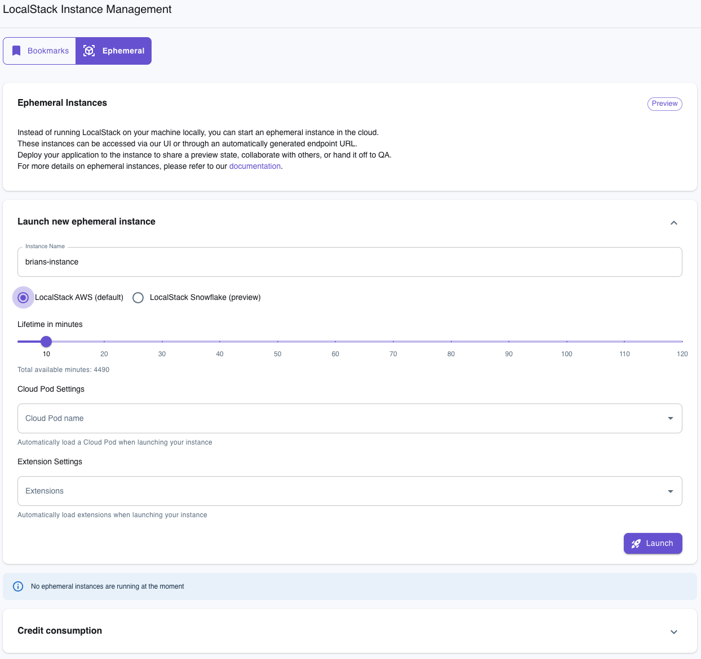
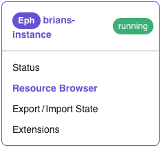
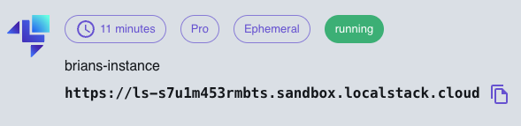

# Some Clever Title About Ephemeral Instances

It's been said that there is a fine line between genius and insanity. Anyone who understands the scale and scope AWS services could have been forgiven for thinking that the idea of a local emulator for AWS rested more on the insanity side of that line. And yet, LocalStack exists.

This feat of engineering is apparently not enough for our team however. "What if we took the local emulator for cloud services and then put it back in the cloud?" they wondered.


Well, we released a new feature called [ephemeral instances](https://docs.localstack.cloud/user-guide/cloud-sandbox/ephemeral-instance/) that does just that. Stick with me though, because this can be incredibly useful for things like:

* **Collaboration** – LocalStack already made iteration and testing easy, but the only direct way to share the state of your work previously was to deploy it to AWS. This can require spinning up (and then removing) a bunch of services. Ephemeral instances make it easy to share a fully-functional, running instance of your code via just a link, while also making cleanup trivial.
* **Previews** – You can integrate ephemeral instances into your continuous integration (CI) processes to enable running application previews of any and every commit. 
* **Acceptance testing** – Similar to the prior items, being able to quickly share a link to view the running application can enable you to get the necessary approvals from stakeholders without having to go through a long and complicated deployment process, which can increase your velocity.
* **Validating and Previewing Cloud Pods** – [Cloud pods](https://docs.localstack.cloud/user-guide/state-management/cloud-pods/) are a tool that enables you to capture a persistent state snapshot of your LocalStack instance that can be restored and even shared. Ephemeral instances allow you to instantly spin up any cloud pod (or even any version of a cloud pod) for quick testing and validation.
* **Docker is unavailable** – There are situations where you may need to run and test your work using LocalStack, but are unable to use Docker, and ephemeral instances will enable you to do that.

Let's look at how this works.

## Create an Ephemeral Instance with the Web App

Manually creating a new ephemeral instance can be done via the LocalStack web app by navigating to *LocalStack Instances > [Ephemeral Instances](https://app.localstack.cloud/instances/ephemeral)* on the left hand navigation.

1. Give the instance a name. It must be alphanumeric with no spaces.
2. Choose LocalStack AWS or the new preview of [LocalStack Snowflake](https://blog.localstack.cloud/2024-05-22-introducing-localstack-for-snowflake/).
3. Set how long you'd like the ephemeral instance to live. After this time period is complete, the ephemeral instance will automatically be cleaned up. Keep in mind that this consumes minutes. The number of minutes available each month depends on the type of account you have.
4. If you'd like to build your instance off of one of your existing Cloud Pods, you can choose it (we'll also explore another option to do this later in this article). If you don't choose one, the instance will start as an empty container with no services running.
5. Optionally, you can choose any [extensions](https://docs.localstack.cloud/user-guide/extensions/extensions-library/) that you might want to have installed on the instance.



Hit the "Launch" button and give it a couple minutes to work its magic.

### Adding Services to a Running Instance

The easiest way to add and manage services running on your ephemeral instance is via the web app. Once the instance is finished deploying, you should see it listed under your LocalStack Instances on the left hand navigation and also listed on the ephemeral instances page.



If you choose the resource browser, you can add any of the services supported on your account to the running instance. For example, click on S3 and then, on the subsequent page, choose "Create." You'll need to complete the bucket details via the form. At a minimum, choose a canned Access Control List (ACL) and a name. Once you submit the form, you should see your bucket created on the ephemeral instance.

To manually upload resources into the bucket, you'll need the instance URL located at the top of the page.



We'll use the [AWS CLI](https://aws.amazon.com/cli/) to move objects into this S3 bucket with the following command (replacing the appropriate values with your ephemeral instance URL, file path and bucket name):

```bash
aws --endpoint-url=<EPHEMERAL_INSTANCE_ENDPOINT_URL> s3 cp /path/to/file s3://bucket-name
```

Returning to the web app, you should see your object stored in your bucket.

Once you have all your services and state set, you can click the "State" tab for your instance and save the state locally or to a Cloud Pod.

## Create an Ephemeral Instance from a Cloud Pod

foo

## Add an Application Preview after Commits

bar