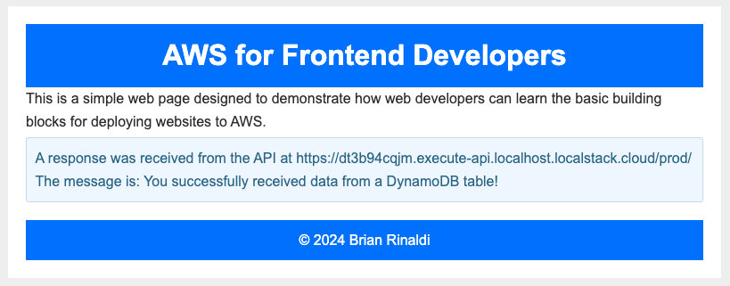
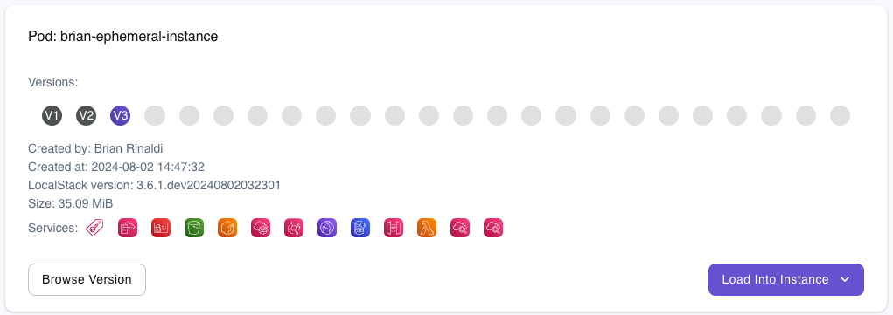

# Local Testing in the Cloud with Ephemeral Instances

It's been said that there is a fine line between genius and insanity. Anyone who understands the scale and scope AWS services could have been forgiven for thinking that the idea of a local emulator for AWS rested more on the insanity side of that line. And yet, LocalStack exists.

This feat of engineering is apparently not enough for our team however. "What if we took the local emulator for cloud services and then put it back in the cloud?" they wondered.


Well, we released a preview of a new feature called [ephemeral instances](https://docs.localstack.cloud/user-guide/cloud-sandbox/ephemeral-instance/) that does just that. Stick with me though, because this can be incredibly useful for things like:

* **Collaboration** – LocalStack already made iteration and testing easy, but the only direct way to share the state of your work previously was to deploy it to AWS. This can require spinning up (and then removing) a bunch of services. Ephemeral instances make it easy to share a fully-functional, running instance of your code via just a link, while also making cleanup trivial.
* **Previews** – You can integrate ephemeral instances into your continuous integration (CI) processes to enable running application previews of any and every commit. 
* **Acceptance testing** – Similar to the prior items, being able to quickly share a link to view the running application can enable you to get the necessary approvals from stakeholders without having to go through a long and complicated deployment process, which can increase your velocity.
* **Validating and Previewing Cloud Pods** – [Cloud pods](https://docs.localstack.cloud/user-guide/state-management/cloud-pods/) are a tool that enables you to capture a persistent state snapshot of your LocalStack instance that can be restored and even shared. Ephemeral instances allow you to instantly spin up any cloud pod (or even any version of a cloud pod) for quick testing and validation.
* **Docker is unavailable** – There are situations where you may need to run and test your work using LocalStack, but are unable to use Docker, and ephemeral instances will enable you to do that.

Let's look at how this works.

_Note: Ephemeral instances are in an early public preview. We'd love for you to try them out and give us your feedback, but, as this is an early preview release, you can expect some rough edges._

## Create an Ephemeral Instance with the Web App

Manually creating a new ephemeral instance can be done via the LocalStack web app by navigating to *LocalStack Instances > [Ephemeral Instances](https://app.localstack.cloud/instances/ephemeral)* on the left hand navigation.

1. Give the instance a name. It must be alphanumeric with no spaces.
2. Choose LocalStack AWS or the new preview of [LocalStack Snowflake](https://blog.localstack.cloud/2024-05-22-introducing-localstack-for-snowflake/).
3. Set how long you'd like the ephemeral instance to live. After this time period is complete, the ephemeral instance will automatically be cleaned up. Keep in mind that this consumes minutes. The number of minutes available each month depends on the type of account you have.
4. If you'd like to build your instance off of one of your existing Cloud Pods, you can choose it (we'll also explore another option to do this later in this article). If you don't choose one, the instance will start as an empty container with no services running.
5. Optionally, you can choose any [extensions](https://docs.localstack.cloud/user-guide/extensions/extensions-library/) that you might want to have installed on the instance.


Hit the "Launch" button and give it a couple minutes to work its magic.

### Adding Services to a Running Instance

The easiest way to add and manage services running on your ephemeral instance is via the web app. Once the instance is finished deploying, you should see it listed under your LocalStack Instances on the left hand navigation and also listed on the ephemeral instances page.


If you choose the resource browser, you can add any of the services supported on your account to the running instance. For example, click on S3 and then, on the subsequent page, choose "Create." You'll need to complete the bucket details via the form. At a minimum, choose a canned Access Control List (ACL) and a name. Once you submit the form, you should see your bucket created on the ephemeral instance.

To manually upload resources into the bucket, you'll need the instance URL located at the top of the page.


We'll use the [AWS CLI](https://aws.amazon.com/cli/) to move objects into this S3 bucket with the following command (replacing the appropriate values with your ephemeral instance URL, file path and bucket name):

```bash
aws --endpoint-url=<EPHEMERAL_INSTANCE_ENDPOINT_URL> s3 cp /path/to/file s3://bucket-name
```

Returning to the web app, you should see your object stored in your bucket.

Once you have all your services and state set, you can click the "State" tab for your instance and save the state locally or to a Cloud Pod.

Creating all the services in your ephemeral instance manually probably isn't the ideal way to work, in part because you are consuming minutes as you do so and, depending on how long you chose for your instance to live, there's also a chance it shuts down before you are done. Instead, it is better to use your local version of LocalStack running on Docker and then use one of the options LocalStack provides for [state management](https://docs.localstack.cloud/user-guide/state-management/) to save the state and load your state into a new ephemeral instance. Let's see how to do that using Cloud Pods.

## Create an Ephemeral Instance from a Cloud Pod

The easiest and most efficient way to create an ephemeral instance is via a [Cloud Pod](https://docs.localstack.cloud/user-guide/state-management/cloud-pods/). Cloud Pods are essentially a snapshot of the state of a running LocalStack instance that can be stored, versioned, shared, and restored. This means that, rather than creating a new empty ephemeral instance, you can create the ephemeral instance with the services or data already deployed.

Let's see how this works. I have an example application I've built using a combination of S3, CloudFront, Lambda, API Gateway and DynamoDB running locally via LocalStack. The message displayed at the bottom of the page is from data pre-loaded into DynamoDB.



Once the application is running locally, the next step is to save the state into a Cloud Pod. In the command below, I am saving this to a new Cloud Pod that I am naming `brian-ephemeral-instance`.

```bash
localstack pod save brian-ephemeral-instance
```

Back in the LocalStack web app, I have several options for loading this instance into an ephemeral instance. For example, I can go directly to the Cloud Pods item on the left-hand navigation, click into the detail page for my `brian-ephemeral-instance` pod and simply click on the "Browse Version" button to create a new instance using the currently selected version of the Cloud Pod that will live for 30 minutes.



One thing to keep in mind is that ephemeral instances run the latest version of LocalStack, so you may run into issues loading Cloud Pods generated against prior versions.

Another option for populating an ephemeral instance is to use the "Load Into Instance" drop down to load the Cloud Pod into an already running instance. Or, lastly, I can go to the "Ephemeral Instances" and then create a new instance, choosing your Cloud Pod from the drop down when configuring the instance settings.

## Add an Application Preview after Commits

Launching ephemeral instances from your Cloud Pods via the web app is an easy way to preview and share a running version of your application. But what if we could automatically create an ephemeral instance to preview our application after each commit? As I'm sure you guessed...you can!

The [Setup LocalStack GitHub Action](https://github.com/localstack/setup-localstack) offers an easy way to integrate starting and stopping a LocalStack ephemeral instance into your workflow to enable things like PR previews. Let's walk through an example.

The workflow below starts by checking the code that we want to deploy out of the repository. Next it uses the Setup LocalStack GitHub Action to start an ephemeral instance. I will need a legacy [LocalStack API key](https://app.localstack.cloud/workspace/api-keys) in order for this to work (note that you may need your administrator's permission to create one of these keys). The GitHub Token will be automatically generated.

The key element to understand is the `preview-cmd`, which runs all the steps that are required to build and deploy your application. As you can see below, this application needs the CDK as well as some npm dependencies installed before it can deploy the code to the ephemeral instance. 

```yaml
name: 'Create Preview on PR'
on:
  pull_request:
    types: [opened, synchronize, reopened]
jobs:
  localstack:
    permissions: write-all
    name: Setup LocalStack Preview
    runs-on: ubuntu-latest
    steps:
      - name: Checkout
        uses: actions/checkout@v4
      - name: LocalStack Preview
        uses: LocalStack/setup-localstack@v0.2.2
        with:
          github-token: ${{ secrets.GITHUB_TOKEN }}
          state-backend: ephemeral
          state-action: start
          include-preview: 'true'
          install-awslocal: 'true'
          preview-cmd: |
            npm install -g aws-cdk-local aws-cdk;
            npm install;
            cdklocal bootstrap --context localenv=ephemeral;
            cdklocal deploy --context localenv=ephemeral --require-approval never;
            distributionId=$(awslocal cloudfront list-distributions | jq -r '.DistributionList.Items[0].Id');
            echo LS_PREVIEW_URL=$AWS_ENDPOINT_URL/cloudfront/$distributionId/ >> $GITHUB_ENV;
        env:
          LOCALSTACK_API_KEY: ${{ secrets.LOCALSTACK_API_KEY }}
```

This workflow is set to run on any PR and will add a comment to the PR with the preview running on a LocalStack instance automatically.

SCREEN SHOT

It's important to note that the steps in the `preview-cmd` are run _after_ the ephemeral instance is created. Therefore, the ephemeral instance exists even if the steps fail. You can always go to the list of running [ephemeral instances](https://app.localstack.cloud/instances/ephemeral) in the LocalStack web app to shut down a running instance. Another option is to use the Setup LocalStack GitHub Action to remove the ephemeral instance if the preview deploy fails. For details on how to do that, [check the documentation](https://docs.localstack.cloud/user-guide/cloud-sandbox/application-previews/).

## Give Ephemeral Instances a Try!

As you can see, the idea of running a local emulator of a cloud environment on the cloud isn't crazy at all. In fact, it enables all sorts of useful capabilities including quick and painless environments for acceptance testing and collaboration and automatic application previews.

But this is just the beginning. Ephemeral instances are only in the early public preview stage and we have a lot of ideas for how to take this feature even further, but we'd also love to hear from you. Give them a try and let us know what you think and share any ideas you may have for how we might make them even more valuable for you. You can always share feedback via our [community Slack]([localstack.cloud/slack](https://localstack.cloud/slack)).