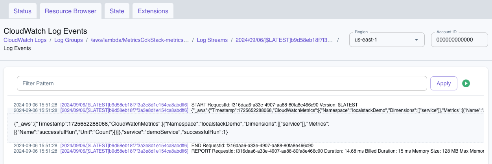
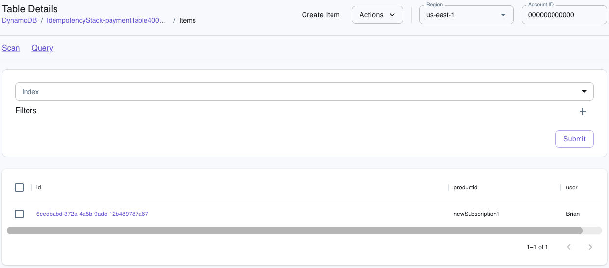
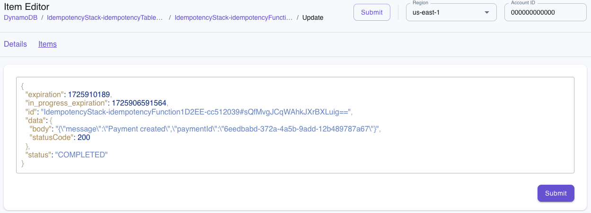

# Serverless Best Practices with AWS Lambda PowerTools

For one-off tasks, AWS Lambda really can be incredibly easy. You write a few lines of code, deploy it, and you have a function running in the cloud ready to respond to events, scale automatically, and that only costs you pennies.

But as your application grows, so does some necessary complexity. When a few one-off functions become a full serverless backend architecture made up of interconnected services, you'll need to pay careful attention to best practices to ensure that your application is easy to debug, maintain, and scale.

That’s where [AWS Powertools for Lambda](https://docs.powertools.aws.dev/lambda/python/latest/) fits in. It’s a suite of reusable utilities designed to simplify bringing best practices around things like logging, tracing, metrics, idempotency and more to your Lambda functions with minimal effort. In this tutorial, we’ll dive into some of the functionality provided by the [AWS Powertools (TypeScript)](https://docs.powertools.aws.dev/lambda/typescript/2.7.0/) core libraries. We'll explore examples on many of the services as well as see how to test them locally with [LocalStack](https://localstack.cloud).

## What is AWS Powertools for Lambda

AWS Powertools for Lambda is an official AWS open source project that maintains multiple utility libraries for [Python](https://docs.powertools.aws.dev/lambda/python/latest/), [TypeScript/JavaScript](https://docs.powertools.aws.dev/lambda/typescript/latest/), [Java](https://docs.powertools.aws.dev/lambda/java/) and [.Net](https://docs.powertools.aws.dev/lambda/dotnet/). Each of these libraries aims to encapsulate a number of serverless best practices into reusable and easy-to-implement utilities.

The libraries aim to simplify implementing common requirements of serverless applications like structured logging and tracing, operational and business metrics and idempotency. Many of the core libraries are available across all languages, although Python is definitely the most comprehensive.

### Middy

[Middy](https://middy.js.org/docs/) is a simple middleware engine for AWS Lambdas written for the Node.js runtime. Middleware allows you to easily reuse cross-cutting concerns across multiple services by intercepting and modifying the request and/or response of a function handler.

Many of the AWS Powertools for Lambda libraries for TypeScript utilize Middy as an option to make it easier to integrate the provided service using a pre-built middleware wrapper. Some of the examples provided in this tutorial will utilize the Middy middleware option.

### Example Repository

To help you give Lambda Powertools a try, we've created an [example repository](https://github.com/localstack-samples/powertools-typescript-demos) with the complete code examples that are discussed in this article. Each Powertools library discussed has both a CDK folder that contains the script needed to deploy the resources to AWS and a Lambda folder containing the example Lambda with a specific Powertools library integration.

These demos can be deployed and run on either AWS or [LocalStack](https://localstack.cloud). The provided Make file contains shortcut commands to install, build and deploy these examples to LocalStack.  To deploy to AWS, you can use the [AWS CLI](https://aws.amazon.com/cli/) and [AWS CDK](https://aws.amazon.com/cdk/). Each of the sections below will detail how to run the example on AWS or LocalStack, as well as make you aware of any specific limitations you might encounter when testing the specific library locally.

To install all the necessary dependencies, run the following command from the root directory of the project:

```bash
make install
```

## Logging

Logging may _seem_ simple enough that we might wonder why we even need a library to solve it. But logs are only as useful as our ability to find the information we need in them. This is why Lambda best practices involve using [stuctured logs](https://docs.aws.amazon.com/lambda/latest/operatorguide/parse-logs.html) that utilize log levels and data in JSON to make them both easier to parse and richer in data that can assist our debugging.

The [Lambda Powertools logger](https://docs.powertools.aws.dev/lambda/typescript/latest/core/logger/) makes using structured logs easy, allowing us to easily assign a log level and provide data as JSON that can be automatically parsed by CloudWatch.

After installing the library via npm and importing it into our Lambda, we can just call the appropriate function for the log level we'd like to use (info, debug, warn, error, critical and silent). For example, here's a very basic handler that might have a warning log:

```typescript

import { Logger } from '@aws-lambda-powertools/logger';

// You want to instantiate the logger outside the handler
const logger = new Logger();

export const handler = async (
  _event: unknown,
  _context: unknown
): Promise<APIGatewayProxyResult> => {
	// perform some operation
	logger.warn('This is a warning');
	// return some result
}
```

We can also optionally provide any additional data we need after the message in the form of JSON:

```typescript
logger.error('This is a warning',
	{message: error.message}
);
```

Logger also offers Middy middleware that will automatically inject the Lambda context info – the function name, ARN, memory size, request ID and whether it was a cold start  – into the logs as data for every log message. The example below uses the logger and Middy middleware to inject this data for our logs and then creates an info level log, appending data from a variable into the JSON for our structured log.

```typescript
import { Logger } from '@aws-lambda-powertools/logger';
import { injectLambdaContext } from '@aws-lambda-powertools/logger/middleware';
import middy from '@middy/core';

const logger = new Logger();

const lambdaHandler = async (
  _event: unknown,
  _context: unknown
): Promise<void> => {
  const importantVariable = 'important';
  // this is the default but we're setting it here for example purposes
  // Accepted values are DEBUG, INFO, WARN, ERROR, CRITICAL, SILENT
  logger.setLogLevel('INFO')

  // You can set a log message and pass in additional keys you want to be logged
  logger.info('This is a structured log message',
    { data: importantVariable }
  );
};

export const handler = middy(lambdaHandler).use(
  injectLambdaContext(logger, { logEvent: true })
);
```

### Running the Example

To give the Logger example a try on LocalStack, run the following command from the root of the project:

```bash
make deploy-logger
```

To deploy this to AWS using the CDK run the following commands:

```bash
cd cdk-logger
cdk bootstrap
cdk deploy
```

#### Limitations of Logger on LocalStack

The primary limitation when testing locally is that, while we can access CloudWatch logs for the Lambda to see the full log data via the [LocalStack web app](https://app.localstack.cloud/inst/default/resources), this currently does not parse the structured JSON data as we would see in production on Amazon CloudWatch.

## Metrics

As was briefly mentioned in the prior section, we can embed JSON into logs and CloudWatch will parse them. In addition to this, CloudWatch supports the [Embedded Metric Format](https://docs.aws.amazon.com/AmazonCloudWatch/latest/monitoring/CloudWatch_Embedded_Metric_Format.html), which is essentially a way of embedding metrics as JSON within logs. Beyond just being parsed and viewable in CloudWatch, these metrics are automatically visualized and we can set alarms to help identify and prevent potential incidents.

The [Lambda Powertools metrics library](https://docs.powertools.aws.dev/lambda/typescript/latest/core/metrics/) not only simplifies writing these metrics into our logs but also adds validation to ensure that metrics are written properly.

In order to send metrics, they need to be flushed. This can be done manually via the `publishStoredMetrics()` function, but the library also supports Middy middleware that will automatically flush for us.

In the provided example, we create a simple metric that counts the number of times that the particular service our Lambda represents has run successfully. We are scoping the metric to a `localstackDemo` namespace and then giving the particular service a name of `demoService`. These values are not required but will default to the `default_namespace` and `service_undefined` if not provided.

Additionally, when adding a metric, they have a type that provides validation for the data being passed. In this example we are manually passing data making validation somewhat redundant, but in other cases this might be data returned from an operation that we want to ensure it a valid metric.  `MetricUnit` provides a large number of constants that can be used for validations.

```typescript
import { MetricUnit, Metrics } from '@aws-lambda-powertools/metrics';
import { logMetrics } from '@aws-lambda-powertools/metrics/middleware';
import middy from '@middy/core';

const metrics = new Metrics({
  namespace: 'localstackDemo',
  serviceName: 'demoService',
});

const lambdaHandler = async (
  _event: unknown,
  _context: unknown
): Promise<void> => {
  metrics.addMetric('successfulRun', MetricUnit.Count, 1);
};

export const handler = middy(lambdaHandler).use(logMetrics(metrics));
```

As we integrate more logs into our application, we may also want to explore additional capabilities such as adding dimensions to a metric or adding high-resolution metrics.

### Running the Example

To give the Logger example a try on LocalStack, run the following command from the root of the project:

```bash
make deploy-metrics
```

To deploy this to AWS using the CDK run the following commands:

```bash
cd cdk-metrics
cdk bootstrap
cdk deploy
```

#### Limitations of Metrics on LocalStack

LocalStack does not yet provide support for metrics added via the Embedded Metric Format. Instead, we can use the [LocalStack web app](https://app.localstack.cloud/inst/default/status) to view the CloudWatch logs for our Lambda to see that the logs are written as expected.



## Tracing

[AWS X-Ray](https://aws.amazon.com/xray/) is a tool for end-to-end tracing of requests in our AWS application to assist in debugging issues that can't be easily seen via logs. To better understand what this means and the benefit of integrating the Lambda Powertools tracing library, we first need to quickly define some X-Ray tracing concepts. 

Within X-Ray, a trace represents an end-to-end user request. A trace can be broken up into segments which represent trace data for specific aspects of our application (the frontend web app versus the API, for example). Segments can be further split into subsegments that allow us to record performance or time on specific portions of code. We can also make it easier to dissect the trace data by adding annotations and metadata.

The Lambda Powertools tracer is an opinionated thin wrapper for [AWS X-Ray SDK for Node.js](https://github.com/aws/aws-xray-sdk-node) that adds some trace data automatically and simplifies further instrumenting Lambdas with X-Ray tracing.

The first thing we need to do once the tracer library is imported is to instantiate the tracer. The `serviceName` is a default annotation that the library adds. It is not required, but providing one prevents it from being annotated as "service_undefined".

In this example, we are also using DynamoDB. In order to capture traces on calls to other AWS services, the libary provides a wrapper that can wrap any AWS SDK client, which we are using to wrap the DynamoDB client.

```typescript
const tracer = new Tracer({ serviceName: 'localstack' });
const client = tracer.captureAWSv3Client(new DynamoDBClient({}));
const dynamo = DynamoDBDocumentClient.from(client);
```
Now that the tracer is created and enabled, we can use it to instrument our code by adding new subsegments and annotations within the code. For example, in the below code we create a subsegment to trace our DynamoDB insert code and add an annotation containing the ID of the resulting record.

```typescript
export const handler = async (event: Request): Promise<APIGatewayProxyResult> => {
  const subsegment = tracer.getSegment()?.addNewSubsegment('### new subsegment');

  try {
    let name = event.name || 'new item';
    const newItem = await createItemRecord(name);
    // Annotate the subsegment with the new object key and then close it
    subsegment?.addAnnotation('newObjectKey', newItem.id);
    subsegment?.close();

    const body = {
      message: 'Item created',
      itemId: newItem.id,
    };

    return {
      statusCode: 200,
      body: JSON.stringify(body),
    };
  } catch (error) {
    throw new Error(error.message);
  }
};
```

### Running the Example

To give the Tracer example a try on LocalStack, run the following command from the root of the project:

```bash
make deploy-tracer
```

To deploy this to AWS using the CDK run the following commands:

```bash
cd cdk-tracer
cdk bootstrap
cdk deploy
```

#### Limitations of Tracer on LocalStack

X-Ray has a [limited number of APIs implemented](https://docs.localstack.cloud/references/coverage/coverage_xray/) and available on the paid tier plans of LocalStack.  This means that the `PutTraceSegments` API call that is used when creating and updating segments will not work without a paid license.

As there is no X-Ray frontend on LocalStack, we can use a combination of the logs and [awslocal](https://docs.localstack.cloud/user-guide/integrations/aws-cli/#localstack-aws-cli-awslocal) (LocalStack's lightweight wrapper around the AWS CLI) to verify that the trace data is working. This takes 3 steps:

1. Using the Lambda function name returned by the CDK output (i.e. replace `TracerStack-tracerFunction` below), execute the function:

```bash
awslocal lambda invoke --function-name TracerStack-tracerFunction --payload '{"name": "Item Name"}' --cli-binary-format raw-in-base64-out output.txt
```
2. Next, [retrieve the trace summaries](https://docs.localstack.cloud/user-guide/aws/xray/#retrieve-trace-summaries) from X-Ray:

```bash
EPOCH=$(date +%s)
awslocal xray get-trace-summaries --start-time $(($EPOCH-600)) --end-time $(($EPOCH))
```

This will return an output similar to the following:
	
```json
{
"TraceSummaries": [
  {
    "Id": "1-66da1a7d-62988bcd7cec2c78310be428",
    {
      "TraceSummaries": [
        {
          "Id": "1-66da1a7d-62988bcd7cec2c78310be428",
            "Duration": 0,
            "ResponseTime": 1,
            "HasFault": false,
            "HasError": false,
            "HasThrottle": false,
            "Http": {},
            "Annotations": {},
            "Users": [],
            "ServiceIds": []
        }
      ],
      "TracesProcessedCount": 1,
      "ApproximateTime": "2024-09-05T16:55:26-04:00"
    }
  }
}
```

3. Take the returned `Id` from the result and query the trace details.
	
```bash
awslocal xray batch-get-traces --trace-ids 1-66da1a7d-62988bcd7cec2c78310be428
```

This will return details about the trace similar to below with the subsegment and annotations listed:
```bash
{
"Traces": [
    {
        "Id": "1-66db45d5-f3c42da2d97c7daa09578565",
        "Duration": 0,
        "Segments": [
            {
                "Id": "41e9488aae1849db",
                "Document": "{\"id\":\"41e9488aae1849db\",\"name\":\"### new subsegment\",\"start_time\":1725646293.929,\"annotations\":{\"newObjectKey\":\"22ef5698-2726-48f0-ba27-c4e9059505b2\"},\"end_time\":1725646294.025,\"type\":\"subsegment\",\"parent_id\":\"73e24ff23e22ec25\",\"trace_id\":\"1-66db45d5-f3c42da2d97c7daa09578565\"}"
            },
            {
                "Id": "4cc31d6339321825",
                "Document": "{\"id\":\"4cc31d6339321825\",\"name\":\"DynamoDB\",\"start_time\":1725646293.943,\"namespace\":\"aws\",\"aws\":{\"operation\":\"PutItem\",\"region\":\"us-east-1\",\"request_id\":\"0159a44f-e9f8-4b90-b515-c4d1bbbda720\",\"retries\":1,\"table_name\":\"TracerStack-itemsTable612CA381-33702d0f\"},\"http\":{\"response\":{\"status\":200,\"content_length\":2}},\"end_time\":1725646294.014,\"type\":\"subsegment\",\"parent_id\":\"73e24ff23e22ec25\",\"trace_id\":\"1-66db45d5-f3c42da2d97c7daa09578565\"}"
            }
        ]
    }
],
"UnprocessedTraceIds": []
}
```

## Parameters

The [Lambda Powertools parameters library](https://docs.powertools.aws.dev/lambda/typescript/latest/utilities/parameters/) provides an easy way to retrieve parameters or configurations. It has built in providers to get parameters stored in AWS Systems Manager Parameter Store, AWS Secrets Manager, AWS AppConfig and Amazon DynamoDB. We can even create our own custom provider to utilize any other parameter store that isn't built in. The library also provides the ability to automatically deserialize parameters that are stored as JSON or Base64.

The first part, of course, is storing the parameters. Our example creates a single parameter stored in SSM as JSON via the CDK. In addition, the Lambda that will read the parameter needs to be given the proper IAM permissions to do so.

```typescript
const param = new ssm.StringParameter(this, 'Parameter', {
  allowedPattern: '.*',
  description: 'A LocalStack test parameter',
  parameterName: '/localstack/parameter',
  stringValue: JSON.stringify({message: 'You have successfully retrieved a parameter from SSM'}),
  tier: ssm.ParameterTier.ADVANCED,
});

const parametersFunction = new NodejsFunction(this, 'parametersFunction', {
  entry: '../parameters-lambda/index.ts',
  handler: 'handler',
});
param.grantRead(parametersFunction);
```

Using these parameters within a Lambda is very straightforward. First, we need to import the appropriate provider. In this case, since we are using SSM, we'll import `@aws-lambda-powertools/parameters/ssm`. In many cases, we won't need to provide anything additional but if we needed more granular control over the behavior such as setting the retry behavior or region, we could provide [additional configuration via the provider class](https://docs.powertools.aws.dev/lambda/typescript/latest/utilities/parameters/#built-in-provider-class).

In our example, we are just getting the singular parameter created by the CDK script and transforming the JSON value that is then returned by the function.

```typescript
import { getParameter } from '@aws-lambda-powertools/parameters/ssm';

export const handler = async (): Promise<string> => {
  // Retrieve a single parameter created during the CDK deployment
  const parameter = await getParameter('/localstack/parameter', {
    transform: 'json',
  });
  
  return parameter as string;
};
```

### Running the Example

To give the Parameters example a try on LocalStack, run the following command from the root of the project:

```bash
make deploy-parameters
```

To deploy this to AWS using the CDK run the following commands:

```bash
cd cdk-parameters
cdk bootstrap
cdk deploy
```

#### Limitations of Tracer on LocalStack

There are no specific known limitations of using the parameters library on LocalStack. The majority of the default providers are available via the open source image with the sole exception of AppConfig.

## Idempotency

Let's imagine we have a Lambda function that inserts transactions into a system that processes payments. We definitely don't want to inadvertently add duplicates because somehow the function was called multiple times, for example via duplicate form submissions. Idempotence describes a property of functions whereby they can be executed multiple times without changing the result beyond the first iteration. So, using the payment processing function example, the first call would add the transaction record, but subsequent calls with the same inputs would simply return the record without adding it.

As you might imagine, making a Lambda function idempotent can be critical in many scenarios, but also complicated to implement. We'd need to ensure that there is a system tracking the function calls and event payload to ensure both that the function isn't run more than once and to return the result of the initial iteration. Luckily, the [Lambda Powertools idempotency library](https://docs.powertools.aws.dev/lambda/typescript/latest/utilities/idempotency/) handles all of this for us.

The library currently supports DynamoDB as its persistent storage layer for event data, so to use it we'll need to create an idempotency table within our stack and pass the table name to our Lambda as an environment variable and also give the Lambda read and write permissions to the database.

```typescript
const idempotencyTable = new Table(this, 'idempotencyTable', {
  partitionKey: {
    name: 'id',
    type: AttributeType.STRING,
  },
  timeToLiveAttribute: 'expiration',
  billingMode: BillingMode.PAY_PER_REQUEST,
});

const fnHandler = new NodejsFunction(this, 'idempotencyFunction', {
  runtime: Runtime.NODEJS_20_X,
  handler: 'handler',
  entry: '../idempotency-lambda/index.ts',
  environment: {
    IDEMPOTENCY_TABLE_NAME: idempotencyTable.tableName,
  },
});
idempotencyTable.grantReadWriteData(fnHandler);
```

We then need to import two function wrappers within our Lambda. The first creates a persistence layer using our DynamoDB table and the second wraps the function handler to make it idempotent, passing in the persistence layer. In this example, we're adding a record to our subscription payment table to process a new subscription transaction and returning the result of that transaction.

```typescript
import { randomUUID } from 'node:crypto';
import { makeIdempotent } from '@aws-lambda-powertools/idempotency';
import { DynamoDBPersistenceLayer } from '@aws-lambda-powertools/idempotency/dynamodb';
import type { Context, APIGatewayProxyResult } from 'aws-lambda';
import type { Request, SubscriptionResult } from './types.js';
import { DynamoDBClient } from "@aws-sdk/client-dynamodb";
import {
  DynamoDBDocumentClient,
  PutCommand,
} from "@aws-sdk/lib-dynamodb";

const client = new DynamoDBClient({});
const dynamo = DynamoDBDocumentClient.from(client);

const persistenceStore = new DynamoDBPersistenceLayer({
  tableName: process.env.IDEMPOTENCY_TABLE_NAME as string,
});

export const handler = makeIdempotent(
  async (event: Request, _context: Context): Promise<APIGatewayProxyResult> => {
    try {
      const payment = await createSubscriptionPayment(event);

      const body = {
        message: 'Payment created',
        paymentId: payment.id,
      };

      return {
        statusCode: 200,
        body: JSON.stringify(body),
      };
    } catch (error) {
      throw new Error('Error creating payment');
    }
  },
  {
    persistenceStore,
  }
);
```

At this point, every subsequent invocation of the function handler with the same event payload (in this case, the same `productId` and `user`) after the initial one, will not insert a new payment record, but will instead return the result of the initial call.

There is, of course, a lot of [additional customization](https://docs.powertools.aws.dev/lambda/typescript/latest/utilities/idempotency/#customizing-the-default-behavior) and capabilities of the library beyond this, such as defining which properties of the event payload or what time period are factored into idempotency. However, the basic implementation is incredibly straightforward.

### Running the Example

To give the Logger example a try on LocalStack, run the following command from the root of the project:

```bash
make deploy-idempotency
```

To deploy this to AWS using the CDK run the following commands:

```bash
cd cdk-idempotency
cdk bootstrap
cdk deploy
```

Once deployed, we can grab the function name returned by the CDK and use the CLI to verify that idempotency is working as expected. For example, we can use `awslocal` to test this function  (`IdempotencyStack-idempotencyFunction`) running on LocalStack by passing a payload to the Lambda.

```bash
awslocal lambda invoke --function-name IdempotencyStack-idempotencyFunction --payload '{"productId": "newSubscription1", "user": "Brian"}' --cli-binary-format raw-in-base64-out output.txt
```

Using the [LocalStack web app's resource browser](https://app.localstack.cloud/inst/default/resources) we can view the items in our transaction table and see that the record has been added.



We can also go to the idempotency table and see the record that Powertools has automatically created for us. It contains an idempotency key that is a hash of the entire event payload.



Now let's try running the function again using the same payload multiple times. We'll see that the same result gets written (to `output.txt` if we're using the command above) but no new records are added. Now try running the function again, but this time change one or both of the properties in the event payload (i.e. `productId` or `user`). When we return to our payments table and we'll see the new record added.

### Limitations of Idempotency on LocalStack

There are no known limitations of using the idempotency library on LocalStack.

## There's Much More...

We covered logging, metrics, parameters, tracing and idempotency, but we have barely scratched the surface in terms of functionality and customization of each library. We also haven't even covered everything within the [Powertools TypeScript libraries](https://docs.powertools.aws.dev/lambda/typescript/latest/) – such as batch processing or JSME path functions – never mind the additional features – like feature flags and streaming – available in the [Python libraries](https://docs.powertools.aws.dev/lambda/python/latest/). The point is, there's a lot more to explore in AWS Lambda Powertools than what one article can cover. So, if you're building Lambdas (and if you made it this far, I think that's a safe assumption), you should definitely add Powertools to your tool belt.
